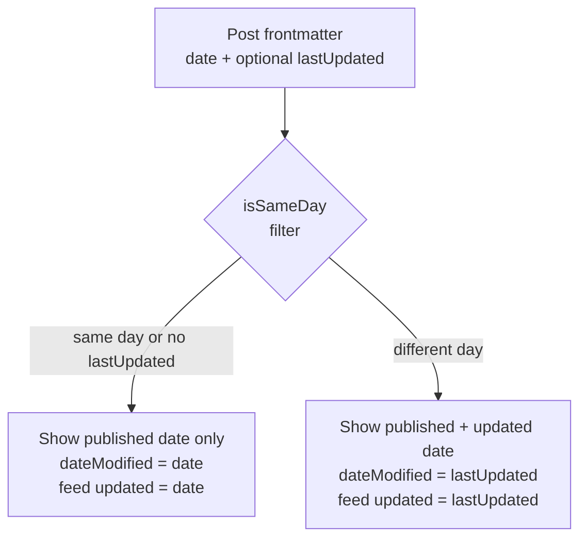

# Design Document: Post Last Updated Date

## Overview

This feature adds a "last updated" date to blog posts on the Eleventy-based static site. When a post has been revised after its original publication, the updated date is displayed near the published date so readers can judge content freshness. The feature is purely additive: posts without a `lastUpdated` frontmatter field are completely unaffected.

The implementation touches four areas:

1. **`_includes/components/posted-date-time.njk`** — conditionally renders the updated date
2. **`_includes/layouts/post.njk`** — updates the `dateModified` field in the JSON-LD structured data block
3. **`feed/feed.njk`** — updates the `<updated>` element in Atom feed entries
4. **`.eleventy.js`** — adds the `isSameDay` filter used by the template logic

No new pages, routes, or data files are required. The `lastUpdated` value is supplied entirely through post frontmatter.

---

## Architecture

The feature follows the existing Eleventy data-cascade and filter pattern. At build time:

1. Eleventy reads each post's frontmatter. If `lastUpdated` is present, it is parsed as a JavaScript `Date` object (Eleventy handles ISO 8601 strings automatically).
2. The `isSameDay` filter (added to `.eleventy.js`) compares `date` and `lastUpdated` at the UTC calendar-day level.
3. Templates use a simple `` guard to decide whether to render the updated date.
4. The same guard drives the `dateModified` value in JSON-LD and the `<updated>` element in the Atom feed.



All logic runs at **build time** — there is no client-side JavaScript involved.

---

## Components and Interfaces

### 1. `isSameDay` Eleventy Filter

Added to `.eleventy.js`:

```js
eleventyConfig.addFilter("isSameDay", (dateA, dateB) => {
  if (!dateA || !dateB) return false;
  const a = DateTime.fromJSDate(dateA, { zone: "utc" });
  const b = DateTime.fromJSDate(dateB, { zone: "utc" });
  return a.toISODate() === b.toISODate();
});
```

- **Input**: two JavaScript `Date` objects (or `null`/`undefined`)
- **Output**: `boolean` — `true` if both fall on the same UTC calendar day
- **Edge cases**: returns `false` if either argument is falsy

### 2. `posted-date-time.njk` Component

The existing component renders only the published date. It is extended to conditionally render the updated date:

```nunjucks

<time datetime="{{ date | getSitemapDate }}" data-updated="true">
  <time class="entry-date" datetime="{{ date | getSitemapDate }}">
    <span class="text-textColor font-ui font-medium text-md md:text-xl uppercase">
      {{ date | displayDateOnly }}
    </span>
  </time>
</time>


<time class="entry-date" datetime="{{ lastUpdated | getSitemapDate }}">
  <span class="text-textColor font-ui font-medium text-md md:text-xl uppercase">
    UPDATED: {{ lastUpdated | displayDateOnly }}
  </span>
</time>

```

- The updated date block is only emitted when `lastUpdated` is truthy **and** differs from `date` by at least one UTC calendar day.
- The same CSS classes (`text-textColor font-ui font-medium text-md md:text-xl uppercase`) are reused, satisfying the typographic parity requirement.
- The `<time>` element's `datetime` attribute uses `getSitemapDate` (produces `yyyy-LL-dd`), consistent with the existing published-date element.

### 3. `post.njk` Layout — JSON-LD `dateModified`

The existing `dateModified` line:

```nunjucks
"dateModified": "{{ date | htmlDateString }}",
```

is replaced with:

```nunjucks
"dateModified": "{{ lastUpdated | htmlDateString }}{{ date | htmlDateString }}",
```

### 4. `feed/feed.njk` — Atom `<updated>` Element

The existing line:

```nunjucks
<updated>{{ post.date | rssDate }}</updated>
```

is replaced with:

```nunjucks
<updated>{{ post.data.lastUpdated | rssDate }}{{ post.date | rssDate }}</updated>
```

---

## Data Models

### Post Frontmatter

No schema changes are required to Eleventy's configuration. The `lastUpdated` field is an optional addition to any post's YAML frontmatter:

```yaml
---
title: "My Post Title"
date: 2024-01-15T09:00:00.000+11:00
lastUpdated: 2025-06-01T10:00:00.000+11:00
tags:
  - posts
---
```

| Field         | Type            | Required | Description                                      |
|---------------|-----------------|----------|--------------------------------------------------|
| `date`        | ISO 8601 string | Yes      | Original publication date (existing field)       |
| `lastUpdated` | ISO 8601 string | No       | Most recent revision date; omit if never revised |

Eleventy automatically parses ISO 8601 strings in frontmatter into JavaScript `Date` objects, so no custom data processing is needed.

### Template Variables

Within templates, the following variables are available for any post:

| Variable      | Type            | Source       | Notes                                      |
|---------------|-----------------|--------------|---------------------------------------------|
| `date`        | `Date`          | Frontmatter  | Always present for posts                    |
| `lastUpdated` | `Date` or falsy | Frontmatter  | `undefined` when not set in frontmatter     |

---

## Correctness Properties

*A property is a characteristic or behavior that should hold true across all valid executions of a system — essentially, a formal statement about what the system should do. Properties serve as the bridge between human-readable specifications and machine-verifiable correctness guarantees.*

### Property 1: `isSameDay` correctly identifies same UTC calendar day

*For any* two JavaScript Date objects that represent the same UTC calendar day (regardless of time-of-day or timezone offset), `isSameDay` SHALL return `true`.

**Validates: Requirements 3.1**

---

### Property 2: `isSameDay` correctly identifies different UTC calendar days

*For any* two JavaScript Date objects that represent different UTC calendar days, `isSameDay` SHALL return `false`.

**Validates: Requirements 3.1**

> **Reflection note**: Properties 1 and 2 together fully specify the `isSameDay` contract. They are kept separate because the generators differ (same-day pairs vs. different-day pairs), but they could be combined into a single round-trip/equivalence property. They are kept distinct here for clarity of failure diagnosis.

---

### Property 3: Null/undefined inputs to `isSameDay` return false

*For any* call to `isSameDay` where at least one argument is `null` or `undefined`, the filter SHALL return `false`.

**Validates: Requirements 3.2**

---

### Property 4: Updated date is displayed when dates differ by at least one calendar day

*For any* post where `lastUpdated` is set and differs from `date` by at least one UTC calendar day, the rendered Date_Component HTML SHALL contain the `lastUpdated` date formatted as `dd-LLL-yyyy` and a label containing "UPDATED".

**Validates: Requirements 2.1, 2.2, 2.3**

---

### Property 5: Updated date `<time>` element has correct `datetime` attribute

*For any* post where `lastUpdated` differs from `date`, the `<time>` element wrapping the updated date SHALL have a `datetime` attribute equal to `lastUpdated` formatted as `yyyy-LL-dd`.

**Validates: Requirements 2.4**

---

### Property 6: No updated date rendered when `lastUpdated` is absent or same day

*For any* post where `lastUpdated` is absent, or where `lastUpdated` falls on the same UTC calendar day as `date`, the rendered Date_Component HTML SHALL NOT contain any "UPDATED" label or a second `<time>` element for the updated date.

**Validates: Requirements 1.2, 1.3, 6.1**

---

### Property 7: JSON-LD `dateModified` reflects `lastUpdated` when dates differ

*For any* post where `lastUpdated` differs from `date` by at least one calendar day, the `dateModified` field in the rendered `application/ld+json` block SHALL equal `lastUpdated` formatted as `yyyy-LL-dd`.

**Validates: Requirements 4.1**

---

### Property 8: JSON-LD `dateModified` falls back to `date` when no valid `lastUpdated`

*For any* post where `lastUpdated` is absent or is the same calendar day as `date`, the `dateModified` field in the rendered `application/ld+json` block SHALL equal `date` formatted as `yyyy-LL-dd`.

**Validates: Requirements 4.2**

> **Reflection note**: Properties 7 and 8 together cover the full `dateModified` contract. They are not redundant — each covers a distinct branch of the conditional.

---

### Property 9: Atom feed `<updated>` reflects `lastUpdated` when dates differ

*For any* post where `lastUpdated` differs from `date` by at least one calendar day, the `<updated>` element in the Atom feed entry for that post SHALL contain the `lastUpdated` date in RSS date format.

**Validates: Requirements 5.1**

---

### Property 10: Atom feed `<updated>` falls back to `date` when no valid `lastUpdated`

*For any* post where `lastUpdated` is absent or is the same calendar day as `date`, the `<updated>` element in the Atom feed entry SHALL contain the `date` in RSS date format.

**Validates: Requirements 5.2**

> **Reflection note**: Properties 9 and 10 mirror Properties 7 and 8 for the feed layer. They are kept because the feed template is a separate file and a separate failure mode.

---

## Error Handling

### Invalid or Unparseable `lastUpdated` Value

If a post author provides a malformed date string (e.g., `lastUpdated: "not-a-date"`), Eleventy will parse it as an invalid `Date` object. The `isSameDay` filter handles this gracefully:

- `DateTime.fromJSDate(invalidDate)` returns an invalid Luxon DateTime.
- `invalidDateTime.toISODate()` returns `null`.
- The comparison `null === validISODate` evaluates to `false`, so the updated date block is not rendered.
- No build error is thrown; the post renders as if `lastUpdated` were absent.

This is acceptable behaviour. Authors should be notified via code review or linting if they supply invalid dates, but the build should not fail.

### `lastUpdated` Before `date`

The feature does not validate that `lastUpdated` is chronologically after `date`. If an author accidentally sets `lastUpdated` to a date before `date`, the `isSameDay` check will still pass (they differ), and the updated date will be displayed — even though it is earlier than the published date. This is an edge case that is unlikely in practice and can be addressed by author convention or a future linting rule. It is out of scope for this feature.

---

## Testing Strategy

### Unit Tests (Example-Based)

These cover specific scenarios and edge cases:

- **`isSameDay` filter**:
  - Same date, same time → `true`
  - Same UTC day, different times → `true`
  - Same UTC day, different timezone offsets that resolve to the same UTC day → `true`
  - One day apart → `false`
  - `null` first argument → `false`
  - `undefined` second argument → `false`
  - Both `null` → `false`

- **Date component rendering**:
  - Post with no `lastUpdated` → only published date rendered, no "UPDATED" label
  - Post with `lastUpdated` same day as `date` → only published date rendered
  - Post with `lastUpdated` one day after `date` → both dates rendered with "UPDATED" label

- **JSON-LD block**:
  - Post with differing `lastUpdated` → `dateModified` equals `lastUpdated | htmlDateString`
  - Post without `lastUpdated` → `dateModified` equals `date | htmlDateString`

- **Atom feed**:
  - Post with differing `lastUpdated` → `<updated>` uses `lastUpdated`
  - Post without `lastUpdated` → `<updated>` uses `date`

### Property-Based Tests

The project uses JavaScript (Node.js). The recommended PBT library is **[fast-check](https://github.com/dubzzz/fast-check)** (well-maintained, zero runtime dependencies, works with any test runner).

Each property test runs a minimum of **100 iterations**.

**Test file**: `tests/post-last-updated.test.js`

Tag format: `Feature: post-last-updated, Property {N}: {property_text}`

| Property | Test description |
|----------|-----------------|
| P1 | Generate two dates on the same UTC calendar day (vary time-of-day); assert `isSameDay` returns `true` |
| P2 | Generate two dates on different UTC calendar days; assert `isSameDay` returns `false` |
| P3 | Generate one valid date and one null/undefined; assert `isSameDay` returns `false` |
| P4 | Generate (date, lastUpdated) pairs differing by ≥1 day; render component; assert output contains formatted `lastUpdated` and "UPDATED" label |
| P5 | Generate (date, lastUpdated) pairs differing by ≥1 day; render component; assert `<time datetime>` equals `lastUpdated | getSitemapDate` |
| P6 | Generate posts with absent or same-day `lastUpdated`; render component; assert no "UPDATED" label in output |
| P7 | Generate (date, lastUpdated) pairs differing by ≥1 day; render layout; parse JSON-LD; assert `dateModified` equals `lastUpdated | htmlDateString` |
| P8 | Generate posts without `lastUpdated` or same-day `lastUpdated`; render layout; parse JSON-LD; assert `dateModified` equals `date | htmlDateString` |
| P9 | Generate (date, lastUpdated) pairs differing by ≥1 day; render feed entry; assert `<updated>` contains `lastUpdated` in RSS date format |
| P10 | Generate posts without `lastUpdated`; render feed entry; assert `<updated>` contains `date` in RSS date format |

### Integration / Visual Smoke Test

- Build the site locally with a test post that has a `lastUpdated` date and visually verify the date component renders correctly in the browser.
- Verify the JSON-LD block in the page source contains the correct `dateModified`.
- Verify the Atom feed at `/atom.xml` contains the correct `<updated>` for the test post.
