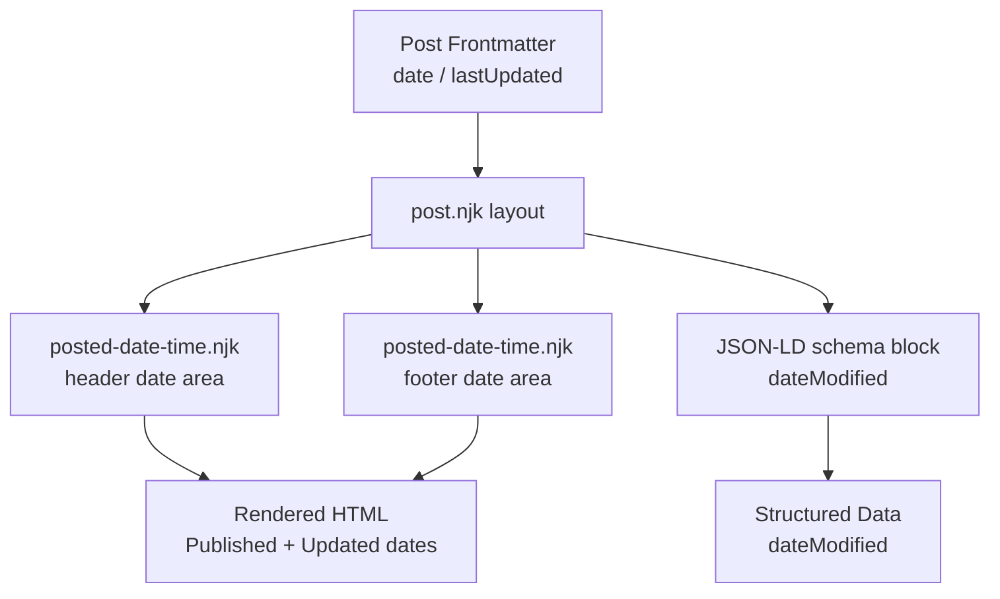

# Design Document: Post Last Updated

## Overview

This feature adds a "last updated" date display to blog posts on Geshan's Blog, an Eleventy/Nunjucks static site. When a post author sets a `lastUpdated` frontmatter field with a date that differs from the original `date` field, the updated date is shown alongside the published date in both the post header and footer. The JSON-LD schema markup is also updated to reflect the correct `dateModified` value.

The change is purely additive and template-driven — no new build plugins or JavaScript are required. The existing `readableDate` and `htmlDateString` Eleventy filters are reused for formatting.

## Architecture

The feature touches three layers of the static site:

1. **Frontmatter** — authors opt in by adding `lastUpdated` to a post's YAML front matter.
2. **Nunjucks templates** — the `posted-date-time.njk` component and `post.njk` layout are updated to conditionally render the updated date.
3. **JSON-LD schema** — the `dateModified` field in `post.njk` is updated to use `lastUpdated` when present and different from `date`.



## Components and Interfaces

### `_includes/components/posted-date-time.njk`

The existing component renders only the `date` field. It will be updated to:

- Accept the `lastUpdated` variable from the template context (already available via Eleventy's data cascade from frontmatter).
- Compute an effective "show updated" condition: `lastUpdated` is present **and** its `htmlDateString` value differs from `date`'s `htmlDateString` value.
- When the condition is true, render an additional `<time>` element with an "Updated:" label.
- When the condition is false, render only the existing published date (no change to current output).

**Condition logic (Nunjucks):**

```nunjucks

```

This comparison uses the `htmlDateString` filter (`yyyy-LL-dd`) to normalise both dates to the same string format before comparing, avoiding any time-of-day differences.

### `_includes/layouts/post.njk`

Two changes:

1. **JSON-LD `dateModified`** — replace the hardcoded `{{ date | htmlDateString }}` with a conditional:

```nunjucks
"dateModified": "{{ lastUpdated | htmlDateString }}{{ date | htmlDateString }}",
```

2. **Template includes** — both the header and footer already use ``. Because Nunjucks `include` inherits the parent context, `lastUpdated` will be available inside the component automatically. No changes to the include calls are needed.

## Data Models

### Post Frontmatter

```yaml
---
title: "My Post Title"
date: 2024-01-15          # required — original publish date (JS Date after Eleventy parsing)
lastUpdated: 2024-06-20   # optional — date of last meaningful revision
---
```

| Field         | Type        | Required | Description                                      |
|---------------|-------------|----------|--------------------------------------------------|
| `date`        | Date string | Yes      | Original publish date; parsed to JS Date by Eleventy |
| `lastUpdated` | Date string | No       | Last revision date; parsed to JS Date by Eleventy when present |

### Effective Display Logic

| `lastUpdated` present? | `lastUpdated` == `date`? | Show updated date? | `dateModified` value |
|------------------------|--------------------------|-------------------|----------------------|
| No                     | —                        | No                | `date`               |
| Yes                    | Yes                      | No                | `date`               |
| Yes                    | No                       | Yes               | `lastUpdated`        |

Equality is determined by comparing the `htmlDateString` (`yyyy-LL-dd`) representation of both dates, so time-of-day differences are ignored.


## Correctness Properties

*A property is a characteristic or behavior that should hold true across all valid executions of a system — essentially, a formal statement about what the system should do. Properties serve as the bridge between human-readable specifications and machine-verifiable correctness guarantees.*

### Property 1: Component renders both dates correctly when they differ

*For any* post where `lastUpdated` is set to a date whose `yyyy-LL-dd` representation differs from that of `date`, the rendered `posted-date-time.njk` output SHALL:
- contain the published date formatted as `dd-LLL-yyyy`,
- contain the updated date formatted as `dd-LLL-yyyy`,
- include a visible "Updated:" label,
- include a `<time>` element with a `datetime` attribute equal to `lastUpdated` formatted as `yyyy-LL-dd`.

**Validates: Requirements 2.1, 2.4, 2.5, 2.6**

### Property 2: Schema `dateModified` reflects `lastUpdated` when it differs from `date`

*For any* post where `lastUpdated` is set to a date whose `yyyy-LL-dd` representation differs from that of `date`, the rendered JSON-LD schema block SHALL set `"dateModified"` to `lastUpdated` formatted as `yyyy-LL-dd`.

**Validates: Requirements 3.1**

---

## Error Handling

Since this feature is purely template-driven with no custom JavaScript or build plugins, error scenarios are limited:

- **Missing `lastUpdated`**: Nunjucks treats an undefined variable as falsy. The `` guard handles this safely — no output change, no error.
- **`lastUpdated` equals `date`**: The string comparison `(lastUpdated | htmlDateString) != (date | htmlDateString)` evaluates to false, suppressing the updated date display. No error.
- **Invalid date value in `lastUpdated`**: Eleventy parses frontmatter dates via js-yaml. If the value is not a valid date, Eleventy will either coerce it or leave it as a string. The `htmlDateString` filter uses Luxon's `DateTime.fromJSDate()` — passing a non-Date object will produce `Invalid DateTime`, which would render as an empty or invalid string. Authors should be advised to use ISO date format (`YYYY-MM-DD`) in frontmatter.
- **`lastUpdated` before `date`**: The feature does not validate chronological order. A `lastUpdated` earlier than `date` would still be displayed if it differs. This is an author responsibility; no runtime guard is added to keep the implementation minimal.

## Testing Strategy

This feature involves Nunjucks template rendering — there is no pure business logic function to unit test in isolation. The appropriate testing approach is **template rendering tests** (example-based) combined with a small number of **property-based tests** over the rendering output.

### PBT Applicability

PBT is applicable here in a limited way: the rendering logic has a clear input (date values) and output (HTML string), and the universal properties (Property 1 and Property 2) hold across all valid date pairs. A property-based testing library can generate random date pairs to exercise the conditional logic.

Recommended library: **[fast-check](https://github.com/dubzzz/fast-check)** (JavaScript, works well with Node.js template rendering tests).

### Unit / Example Tests

These cover the specific branches not addressed by property tests:

| Test | Criteria |
|------|----------|
| Component renders only published date when `lastUpdated` is absent | 1.2, 2.2 |
| Component renders only published date when `lastUpdated` equals `date` | 1.3, 2.3 |
| Schema `dateModified` equals `date` when `lastUpdated` is absent | 3.2 |
| Schema `dateModified` equals `date` when `lastUpdated` equals `date` | 3.3 |
| Post layout renders updated date in both header and footer | 4.1 |

### Property Tests

Each property test runs a minimum of **100 iterations** with randomly generated date pairs.

**Property 1 test** — generate random `(date, lastUpdated)` pairs where `htmlDateString(date) !== htmlDateString(lastUpdated)`, render the component, assert all four conditions hold.

Tag: `Feature: post-last-updated, Property 1: component renders both dates correctly when they differ`

**Property 2 test** — generate random `(date, lastUpdated)` pairs where they differ, render the schema block, assert `dateModified` equals `htmlDateString(lastUpdated)`.

Tag: `Feature: post-last-updated, Property 2: schema dateModified reflects lastUpdated when it differs from date`

### Template Rendering Approach

Since Eleventy templates are Nunjucks files, tests can use the **nunjucks** npm package directly to render the component with a mock context object, without needing a full Eleventy build. This keeps tests fast and isolated.

```js
const nunjucks = require('nunjucks');
// Configure environment with the same filters as .eleventy.js
// Render posted-date-time.njk with a context { date, lastUpdated }
// Assert on the rendered HTML string
```
